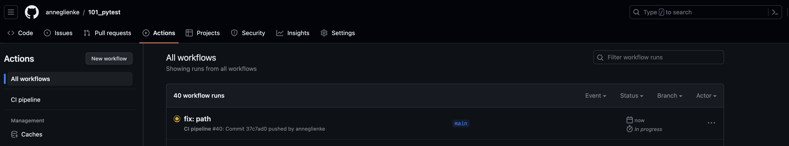

## 1 Purpose of this repo
The purpose of this repository is mainly to explore [pytest](https://docs.pytest.org/en/7.3.x/). Tests can be found in [tests](tests). 

To ensure code quality, this repository leverages the capabilities of pre-commit. If you're curious about pre-commit and want to explore its features further, I recommend checking out this other repository: [101_pre-commit](https://github.com/anneglienke/101_pre-commit)

<br />

## Table of contents 

| Content                  | Description |
| ------                   | ------ |
| [images]()               | folder with the images used on readme |
| [docker-compose.yml]()   | docker-compose file |
| [Dockerfile]()           | dockerfile |
| [push.py]()              | script that pulls data from SentiCrypt API and pushes it to Stitch Import API |
| [query_validation.sql]() | validation queries to check on empty, null and duplicated values |
| [requirements.txt]()     | requirements to run push.py|

<br />

## 2 Running locally
To run locally, you will need Python 3.11 or newer installed in your local environment. Then, just install the dependencies and execute the `main.py` file:

Create a virtual environment:
```
python3 -m venv .venv
```

Activate local environment:
```
source .venv/bin/activate
```

Install dependencies:
```
pip install -r requirements.txt
```

Install git hooks (optional, do it only if you wanna use pre-commit):
```
pre-commit install
```

Run script:
```
python3 src/main.py
```

Run tests:
```
pytest -v tests
```
Run test coverage command to generate report locally (it will be generated by the GitHub Actions workflow automatically and it will be stored as an artifact. You can look for it there instead of generating it locally, if you prefer.):
```
pytest --cov --cov-report=html
```

If you installed git hooks but wanna skip pre-commit checks, run:
```
git commit -m"message" --no-verify
```

<br />

## 4 Finding the Coverage Report generated by Github Actions worklow

<br />

Go to the [project](https://github.com/anneglienke/101_pytest) in Github and click in `Actions` (top left):
<br />


<br />

Select the last workflow run:
<br />


<br />

Once it's finished, you should be able to see the artifacts it generated (bottom):
<br />


<br />

Download it, unzip it. To see the Test Coverage Report, click on `coverage-report.html` and open `index.html`
<br />


<br />

You should see something like this:
<br />


<br />

To expand and see more details, click in `src/main.py`:
<br />


